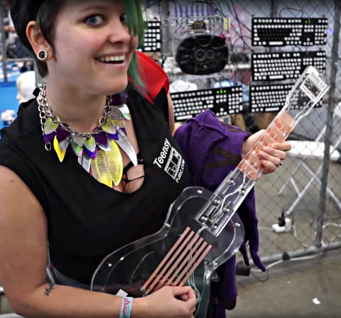

TouchGuitar
===========

Guitar example using capacitive touch sensing and Karplus Strong plucked string synthesis from the Teensy Audio Library.

[Watch Alysia Dynamik play TouchGuitar at Maker Faire 2016](https://youtu.be/TidIpeY_6T8?t=12s).  Thanks to Adafruit for shooting this quick video.

